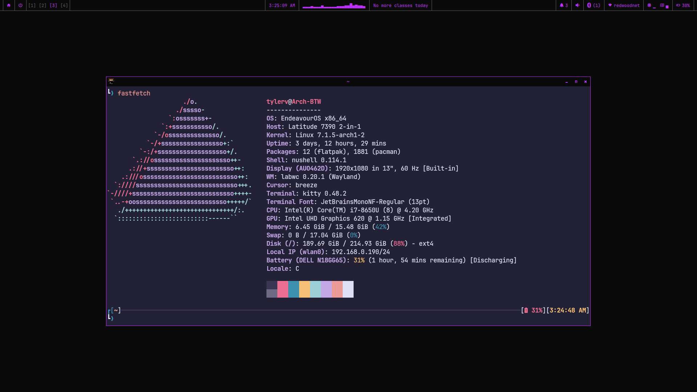

# dotfiles (laptop)

Personal dotfiles for this machine, managed with [GNU Stow](https://www.gnu.org/software/stow/). This is the `laptop` branch — other machines/branches may run a different stack (older setups used niri + eww + fish instead of what's here).

## Stack

- **WM**: [labwc](https://labwc.github.io/)
- **Shell (desktop)**: [qs-shell](https://github.com/Typhoon1551/qs-shell) — a custom Quickshell-based bar/launcher/notifications/theming shell, kept in its own repo since it's a real project rather than a config file. Clone it separately to `~/Projects/qs-shell`; labwc's `autostart` expects it there.
- **Terminal**: kitty
- **Editor**: helix
- **Shell (CLI)**: nushell
- **Prompt**: starship
- **Multiplexer**: zellij
- **Theming**: [hellwal](https://github.com/danihek/hellwal), driving wallpaper-based color generation for qs-shell's Theme Editor

## Screenshot



## Installation

```sh
git clone --branch laptop https://github.com/Typhoon1551/dotfiles.git ~/dotfiles
git clone https://github.com/Typhoon1551/qs-shell.git ~/Projects/qs-shell
cd ~/dotfiles
stow */
```

`stow */` links every package at once; pass individual package names (e.g. `stow labwc kitty`) to be selective.

## Dependencies

Beyond the packages above and whatever's needed for qs-shell itself (see [its README](https://github.com/Typhoon1551/qs-shell)), the session as a whole expects:

- `swaybg`, `swaylock`, `swayidle` — wallpaper, lock screen, idle handling
- `wl-clipboard`, `cliphist` — clipboard history
- `grim`, `slurp` — screenshots (`labwc/.config/labwc/scripts/screenshot.sh`)
- For the audio visualizer specifically: [cavablocks-zig](https://github.com/Typhoon1551/cavablocks-zig), expected at `~/Projects/cavablocks-zig`
