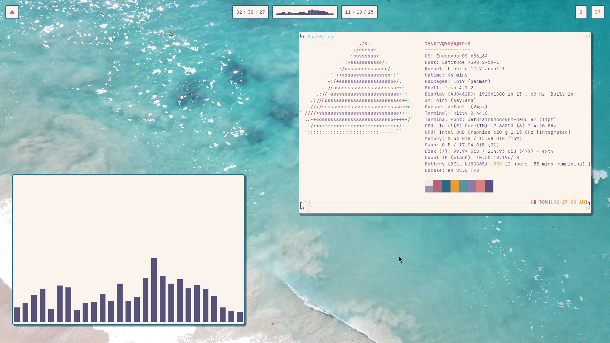

# DOTFILES

These are my dotfiles

## Pictures

## Installation

### Dependencies

For the audio visualizer in the taskbar you must:
- Install [https://github.com/Typhoon1551/cavablocks](https://github.com/Typhoon1551/cavablocks)
- Change the path of the `cavablocks` symlink to the path of your executable

### Usage

`git clone` and `stow`
